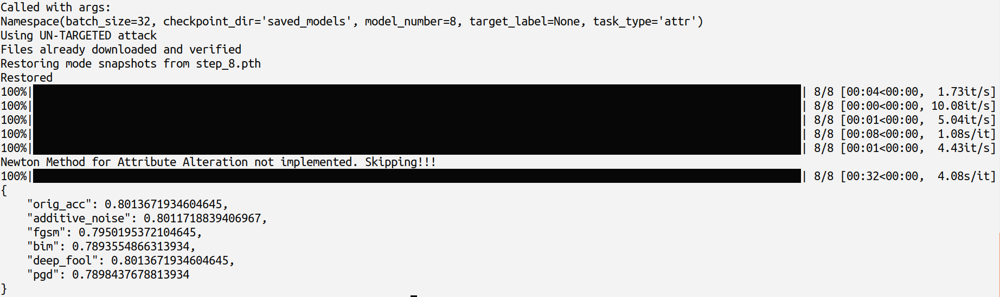
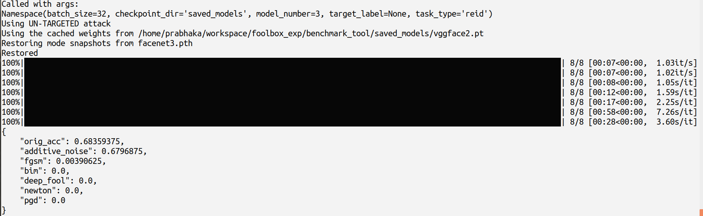
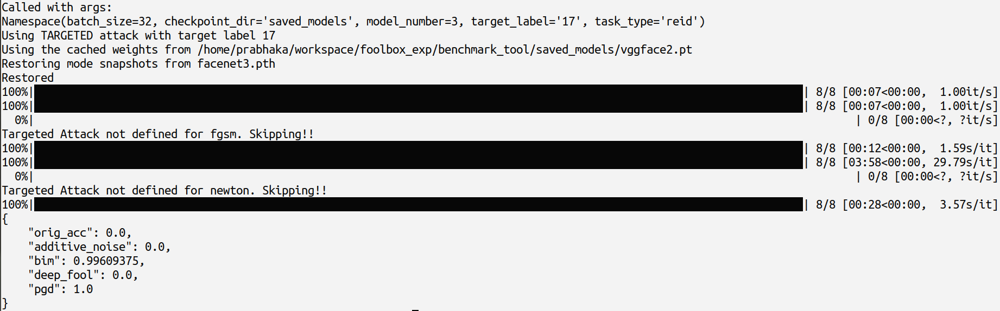

### Adversarial Machine Learning Benchmark Tool

This tool is intended to facilitate easy conversion of models trained using PyTorch or any other Deep Learning framework into
[FoolBox](https://github.com/bethgelab/foolbox). Foolbox is an open source framework which maintains regularly updated code implementation of latest
adversarial attacks. We have created this tool as a wrapper to Foolbox with functionality relevant to various use-caseses. 

This benchmark tool would allow an easy conversion of their PyTorch/Tensorflow/Keras etc models and hence, one can easily test his/her model
against all the attack implementations available.


### Tool Structure

We have structured our tool as follows:-
1. attacks - The module contains some sample attack implementations. One can use these as a template and easily implement other Foolbox adversarial attacks too.
2. dataset - Contains the code for loading differnt dataset such as[CelebA](http://mmlab.ie.cuhk.edu.hk/projects/CelebA.html).
3. model - Contains the source code for a model. We have a PyTorch model in the directory as an example. Please note that we expect that the model is already trained and we are going to test it against adversarial.
perturbations. Hence, we ***do not*** provide any code for training of the model. For our example mode, in case you want to train a model from scratch, please check [here](https://git.sec.in.tum.de/Norouzian/safair-ai-contest).
4. use_cases - Contains logic specific to the  various use-casess. Our examples are Face-Reidentification and Attribute Alterations as outlined [here](https://www.sec.in.tum.de/i20/projects/sparta-safair-ai-contest).
5. wrapper - Contains the model converter. This would take a model and convert it into FoolBox.

We would like to re-iterate that we expect that the model is already trained. Hence, please make sure you have saved the model weights. The model conversion process
would first load the model weights and then convert the model to Foolbox.

### Execution Steps

To start with execute 
>>> python main.py -h

To get a list of options and instructions to execute the program.
For starting a simple training loop, simply use
>>> python main.py --task_type attr --checkpoint_dir saved_models --model_number 0

Since the options have default arguments in most of the cases (please check `main.py` file for the entire list), one can make use of the default options and
reduce the above command command to

>>> python main.py 

In our examples, we support two tasks currently.
1. Targeted Re-identification
2. Facial Attribute manipulations

This can be selected by using `task_type` argument. For instance,
>>> python main.py --checkpoint_dir saved_models --task_type reid --model_number 0

Here we specify the `checkpoint_dir` and `model_number` (Specific model to load). We expect that model weights are present in the `saved_models` folder before starting the conversion process.

The results shall be computed on the CelebA dataset.


### Creating a new Attack

To create a new Attack, please create a new python file in the `attacks/attack_types` package. Please make sure all attacks extend the ```attacks.base.Attack``` class.

The class has three methods that are used:-
* instantiate_attack() -> Which is used in order to create an instance of `attack` type defined in Foolbox framework.
* attack_description() -> A string representation of the attack. Please check [this](#Config) to see how this comes in handy for the tool. 

Once this is done, the tool would automatically recognize the new Attack and compute the model performance against the new attack along with the previous ones (***Basically all the Attacks that are present in the `attacks.attack_types` package***)

However, there is a way to skip certain attacks if there is a need. Please check [here](#Config)

### Config

There may be scenarios in which you want to skip certain attack types (for instacne Carlini and Wagner). This can be done by editing the `config.py` file. The `skip_list` can be used to skip attacks.
The tool performs string matching based on the string representation of each attack class. For instance, if you want to skip c&w attack, just use
```
skip_list = ['carlini_wagner']
```   
The string representation of Carlini and Wagner attack is `carlini_wagner` and the same name needs to be used in the configuration list.

If the `skip_list` is empty, we run the model against all the test types.


### Targeted Attacks
One can perform Targeted Attacks as well. For this simply pass `--target label ` flag with an appropriate target label. For instance,
```
python main.py --checkpoint_dir saved_models --task_type reid --model_number 3 --target_label 17
```

* The Targeted Attacks are ***not defined for Attribute Alteration tasks*** and the tool would throw an error before starting. 
* There are certain attacks such as `FGSM` for which Targted Attacks are not defined by Foolbox. They would be skipped and the tool would compute results
for the remaining attack types.

### Sample Output
Here are some sample output obtained from the execution of the tool.

When executed with the command 
```
python main.py --checkpoint_dir saved_models --model_number 8
``` 

Similarly, when we execute the tool for performing Un-targeted ReIdentification task. 
```
python main.py --checkpoint_dir saved_models --task_type reid --model_number 3
``` 

Finally, when we execute the tool for targeted ReIdentification task, we would get
```
python main.py --checkpoint_dir saved_models --task_type reid --model_number 3 --target_label 17
``` 


### Support for different frameworks
The bechmark tool also supports Tensorflow or Keras models too. The respective model definitions using the desired library should be included. Once the class members are defined, one can import the model class in the `main.py` file and then convert it using `tensorflow_to_foolbox` module. If your method uses multiple models, it can be handled easily by properly organizing it under parent model and then call it accordingly. Necessary data processing steps should be included while passing the batches of data from the benchmark_tool. 

### Changing in loss/Evaluation
In case any kind of further postprocessing is desired regarding the output that comes from the foolbox model, that are to be passed to another foolbox model or there is a need to change the loss-function or evaluation metric, one should keep in mind the use of [Eagerpy](https://github.com/jonasrauber/eagerpy). Here the `eagerpy` is used to convert tensors from respective libraries of eagerpy tensors. Most basic operations needed to introduce different loss or any further postprocessing are available in Eagerpy.

### Limitations
The Foolbox framework does not support Multi-label classification out of the box. Hence, ***it does not support Attribute Alteration Task*** directly. We have modified 
the tool by adding a wrapper which can manage all instances of ***FixedEpsilonAttack***. Please take a look at ***fgsm.py*** file to see how this is done. 

However, for ***AttackWithDistance*** subclasses (for instance carlini_wagner) it is not possible to perform monkey patching and manage the code. The only possible way
is to ovveride the `run` method [here](https://github.com/bethgelab/foolbox/blob/cbad38f6623c8d97c12a9064cb79c7d150392c7f/foolbox/attacks/carlini_wagner.py#L62) and basically
copy everything with changes to the code as per need. For the sake of keeping the framework simpler and easily extensible, we decided to skip the operation for such cases. 
Developers are encouraged to update the code themselves and reach out to us for any help.
 
 
 
  
 
